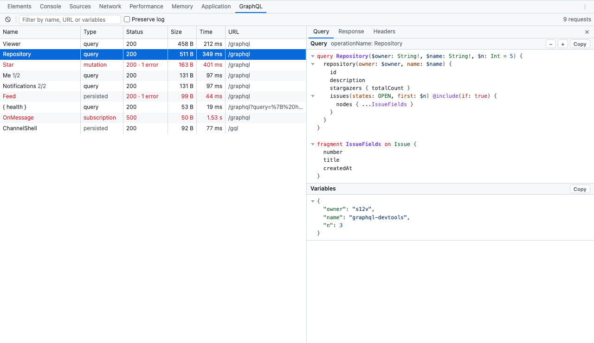

# GraphQL developer tools (browser extension)

[](https://github.com/s12v/graphql-devtools/actions/workflows/ci.yml)
[](LICENSE)

A **GraphQL** panel in the browser's DevTools (Chrome, Firefox): every GraphQL operation the page sends, with its
query, variables, response, errors and headers — the Network panel, narrowed down to GraphQL.



Demo with sample traffic: https://s12v.github.io/graphql-devtools/

## Install

[Chrome Web Store](https://chromewebstore.google.com/detail/hflnkihcpgldmkepajmpooacmmhglpff), then open DevTools on
any page that talks GraphQL — the **GraphQL** tab is at the end of the tab strip.

To run from source: `git clone https://github.com/s12v/graphql-devtools`, open `chrome://extensions`, enable
**Developer mode**, **Load unpacked** → select the `graphql-devtools` directory.

**Firefox:** `graphql-devtools-<version>-firefox.zip` from the [releases](https://github.com/s12v/graphql-devtools/releases)
loads through `about:debugging` → This Firefox → **Load Temporary Add-on** (it is gone after a restart until the add-on
is signed on addons.mozilla.org).

## What it shows

* One row per operation: name (the operation name, or the first field of an anonymous query), type
  (query / mutation / subscription / persisted), HTTP status with the number of GraphQL `errors`, size, time, URL.
  Rows with an HTTP error or GraphQL errors are red. Click a column to sort; the counter sums the rows in view.
* **Query** tab: the document with syntax colours — pretty-printed when the client sent it minified (Relay,
  urql, gql.tada…), **as sent** on request — with the variables and the extensions under it. A persisted query
  whose document was seen in another request with the same hash (Apollo's APQ retry) shows that document.
* **Resend** sends the same request again from the page — with its cookies and headers — and the answer
  arrives as a new row marked ↻; **Edit & resend** lets you change the document or the variables first
  (a mutation asks twice).
* **Response** tab: the pretty-printed response, with the error messages on top.
* **Headers** tab: URL, method, status, timing phases (wait / receive…), `Server-Timing`, request and response
  headers, **Copy as cURL**.
* Every block has a **Copy** button; queries and JSON fold — a triangle on every multi-line bracket, a
  collapsed one shows `{ … 3 keys }`, **−** / **+** collapse or expand the whole view.
* Filter by name, URL or variables, by operation type, or **Errors** only; **Group** folds repeated operations
  into one row with a count, the errors, the total size and the average time — the quickest way to spot an
  N+1; **Clear**; **Preserve log** across navigations; arrow keys move the selection; Cmd/Ctrl+F focuses the
  filter.
* Requests recorded since DevTools was opened appear when the panel is first shown.
* Follows the DevTools theme, light or dark.

Recognised request shapes: a JSON body with `query` (whatever the `Content-Type`), a batch (JSON array),
`GET` with the query in the URL, `application/graphql`, form-encoded and multipart uploads
(`operations` field), and persisted queries — Apollo's `extensions.persistedQuery.sha256Hash`, Relay and
Facebook document ids, GitHub's `?body=` with a hash, X's `/graphql/<id>/<Name>` — listed by their operation
name. A `query` that is not a GraphQL document (a site's search parameter, say) is left alone.

## Privacy

Everything happens in the DevTools window: the extension reads requests through the DevTools network API,
makes no requests of its own and requests no permissions. Full text: [PRIVACY.md](PRIVACY.md).

## Development

No build step, no dependencies. Tests run on Node 20+:

```
npm test
```

`panel.html` opened outside DevTools (serve the directory over HTTP, e.g. `python3 -m http.server`) shows the
sample traffic from `demo/har.js`; add `?theme=dark` for the dark palette.

## Release

1. Set the same new version in `manifest.json` and `package.json`, commit.
2. Tag and push: `git tag v1.3.0 && git push origin master v1.3.0`.
3. The Release workflow runs the tests, builds `graphql-devtools-1.3.0.zip` and `graphql-devtools-1.3.0-firefox.zip`
   (`npm run build` does the same locally into `dist/`) and attaches them to a GitHub Release.
4. Upload the Chrome zip in the [Chrome Web Store developer dashboard](https://chrome.google.com/webstore/devconsole)
   and the Firefox one on [addons.mozilla.org](https://addons.mozilla.org/developers/).

## License

MIT
